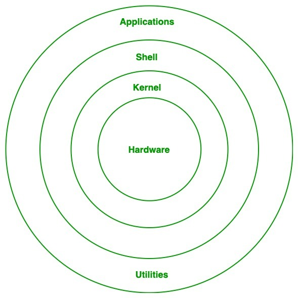

# mastering_linux
A beginner-friendly guide to learn and explore Linux basics, commands, and usage.

<h2>What is Linux? 👩‍🏫‍ </h2>
Linux is a free and open-source operating system, like Windows or macOS, that helps your computer run and manage tasks. It's widely used in servers, mobile phones and even supercomputers.

<h2>Why Linux? &#x1F914 </h2>
<ul><li>We use Linux because it's free, secure, and reliable.</li>
<li>It doesn't slow down easily, works well on old computers.</li>
<li>It is widely used in programming, servers, and ethical hacking.</li></ul>

<h2>Uses of Linux</h2>
<ol><li><b>Servers: </b>Most websites run on Linux servers because it's stable and secure.</li>
<li><b>Programming & Development: </b>Preferred by coders due to its powerful tools and flexibility.</li>
<li><b>Android OS: </b>Android is based on Linux, so it's used in mobile phones.</li>
<li><b>Supercomputers & Embedded Systems: </b>Powers most supercomputers and smart devices(like TVs, routers).</li></ol>

<h2>Difference between Linux and Windows</h2>

| Feature | Linux | Windows |
| ---- | ---- | ---- |
| License | Free and open-source | Paid and closed-source |
| Customization | Highly customizable | Limited customization |
| Security | More secure, fewer viruses | More prone to viruses |
| Performace | Lightweight, runs well on older hardware | Heavier, needs more system resources |
| Usage | Common in servers, coding, hacking | Common in personal and office use |
| Support | Community support | Official Microsoft support |

<h2>Booting and its types</h2>
<b>BOOTING: </b>Booting is the process of starting a computer when you turn it on. It loads the operating system so you can use the computer.<br></br>
<b>TYPES OF BOOTING: </b>
<ol><li><b>Cold Booting- </b>When you start the computer from a completely off state by pressing the power button. It is also known as Hard booting.<br>
E.g. You press the power button on your computer in the morning after it was shut down overnight.</li>
<li><b>Warm Booting- </b>When you restart the computer without turning it off, like using the restart option. It is also known as soft booting<br>
E.g. You click the "Restart" option from the Start menu to reboot your computer while it's already on.</li></ol>

<h2>Structure of Linux:</h2>


<h2>Kernal</h2>
The kernal is the core part of the linux operating system. It connects the hardware and software, manages system resources like CPU, memory, and devices, and allows programs to run and communicate with the hardware.<br></br>
<b>Key Functions:</b><br>
<ul><li>Controls hardware (keyboard, disk, etc.) 
<li>File management</li>
<li>Process management</li>
<li>I/O management</li>
<li>Memory management</li>
<li>Device management</li></ul>

<h2>Shell</h2>
Shell is a program that lets you interact with the computer by typing commands. It acts like an interface between user and the operating system.
It takes your commands, sends them to the system, and shows the result.<br></br>
<h4>Types of Shell:</h4>
<ul><li><b>Bash (Bourne Again Shell)- </b>Most common and user-friendly</li>
<li><b>Sh (Bourne Shell)- </b>Older shell, simple and fast</li>
<li><b>Csh (C Shell)- </b>Syntax similar to C programming</li>
<li><b>Ksh (Korn Shell)- </b>Combines features of Bourne and C shell</li></ul><br>
<h4>Categories of Shell:</h4>
<ul><li><b>Command Line Shell- </b>You type commands (like in a terminal)</li><br>


<li><b>Graphical Shell- </b>You click on icons (like desktop environment)</li><br>


</ul>

<h2>Utilities:</h2>
Utilities are small programs or tools in an operating system that helps you perform basic tasks. They make it easier to manage files, folders, system settings, and more.<br></br>
<b>Examples: </b>copying files, checking disk shape, or setting passwords.

<h2>Linux Commands Overview:</h2>
<h3><b>(1) ls</b></h3>
<ul><li><b>Description: </b>Lists files and directories in the current folder.</li>
<li><b>Syntax: </b>ls [options]</li>
<li><b>Example: </b></li></ul>

```bash
ubuntu@ubuntu:~$ ls 
Desktop    Downloads   Pictures   Templates   snap 
Documents  Music    Public    Videos
```
<i>It shows all the contents and files of the current folder.</i>

<h3><b>(2) cd</b></h3>
<ul><li><b>Description: </b>Changes the current directory</li>
<li><b>Syntax: </b>cd [directory]</li>
<li><b>Example: </b></li></ul>

```bash
ubuntu@ubuntu:~$ cd Documents/
ubuntu@ubuntu:~/Documents$
```
<i>It changes the current directory.</i>

<h3><b>(3) pwd</b></h3>
<ul><li><b>Description: </b>Shows the current working directory</li>
<li><b>Syntax: </b>pwd</li>
<li><b>Example:</b><br></li></ul>

```bash
ubuntu@ubuntu:~$ pwd 
/home/user/Documents
```
<i>It shows that the user is currently in the "Documents" directory.</i>

<h3><b>(4) mkdir</b></h3>
<ul><li><b>Description: </b>Used to make a new directory</li>
<li><b>Syntax: </b>mkdir [folder-name]</li>
<li><b>Example: </b></li></ul>

```bash
ubuntu@ubuntu:~$ mkdir dailyreport
ubuntu@ubuntu:~$
```
<i>It creates a new directory named "dailyreport".</i>

<h3><b>(5) cat ></b></h3>
<ul><li><b>Description: </b>Used to create a new file and write content into it from the terminal</li>
<li><b>Syntax: </b>cat > [file_name]</li>
<li><b>Example: </b></li></ul>

```bash
ubuntu@ubuntu:~$ cat > dailyreport
bash: dailyreport: Is a directory
```

```bash
ubuntu@ubuntu:~$ cat > day2
This is my day2.
```
<i>It lets you type and save content into a file(overwrites if it exists).</i><br></br>
<b>[NOTE: Use Ctrl+D to exit from it.]</b>

<h3><b>(6) touch</b></h3>
<ul><li><b>Description: </b>creates file without content or create a new empty file or update the timestamp of an existing file</li>
<li><b>Syntax: </b>touch [file_name]</li>
<li><b>Example: </b></li></ul>

```bash
ubuntu@ubuntu:~$ touch day1
ubuntu@ubuntu:~$
```
<i>It creates a new empty file named 'day1'.</i>

<h3><b>(7) rmdir</b></h3>
<ul><li><b>Description: </b>remove empty directories</li>
<li><b>Syntax: </b>rmdir [directory-name]</li>
<li><b>Example: </b></li></ul>

```bash
ubuntu@ubuntu:~$ rmdir dailyreport
ubuntu@ubuntu:~$
```
<i>It removes or deletes the directory named "dailyreport".</i><br></br>
<b>[NOTE: This will delete the directory named dailyreport only if it is empty, however if it is not empty, rmdir will give an error.]</b>

<h3><b>(8) cp</b></h3>
<ul><li><b>Description: </b>Used to copy the files or directories from one location to another</li>
<li><b>Syntax: </b>cp [source] [destination]</li>
<li><b>Example: </b></li></ul>

```bash
ubuntu@ubuntu:~$ cp day2 d2
ubuntu@ubuntu:~$
```
<i>It will copy the file named 'day2' to 'd2'.</i><br></br>
<b>[NOTE: The 'day2' file has been copied into 'd2', but the file named 'day2' still exists - it hasn't been removed.]</b>

<h3><b>(9) mv</b></h3>
<ul><li><b>Description: </b>Used to move the files or directories from one location to another</li>
<li><b>Syntax: </b>mv [source] [destination]</li>
<li><b>Example: </b></li></ul>

```bash
ubuntu@ubuntu:~$ mv day1 d1
ubuntu@ubuntu:~$
```
<i>It will move the file named 'day1' to 'd1'.<br></br>
In other words it is used to rename a file.</i><br></br>
<b>[NOTE: The 'day1' file has been moved to 'd1',so the original 'day1' file is deleted. In other words, 'day1' has been renamed to 'd1'.]</b>

<h3><b>(10) whoami</b></h3>
<ul><li><b>Description: </b>shows the username of the currently logged-in user.</li>
<li><b>Syntax: </b>whoami</li>
<li><b>Example: </b></li></ul>

```bash
ubuntu@ubuntu:~$ whoami
ubuntu
```
<i>This means the current user is ubuntu.</i>

<h3><b>(11) whatis</b></h3>
<ul><li><b>Description: </b>Gave a brief description of a linux command.</li>
<li><b>Syntax: </b>whatis [command_name]</li>
<li><b>Example: </b></li></ul>

```bash
ubuntu@ubuntu:~$ whatis cat
cat (1)          - concatenate filed and print on the standard ou...
```
<i>This gives a brief info about cat</i><br>
<b><ul>NOTE:<li>If the output says 'nothing appropriate' that means your man database is not updated or The man-db package(which stores command descriptions) might not be installed.</li>
<li>To update it just search sudo mandb in terminal,it'll automatically update your man database.</li></ul></b>

<h3><b>(12) whereis</b></h3>
<ul><li><b>Description: </b>To find the location of a command's binary file,source code, and manual page.</li>
<li><b>Syntax: </b>whereis [command_name]</li>
<li><b>Example: </b></li></ul>

```bash
ubuntu@ubuntu:~$ whereis cat
cat: /usr/bin/cat/ usr/share/man/man1/cat.1.gz
```
<i>This means command cat is in /bin/ cat</i><br>
<i>The manual file is located in /usr/share/man/...</i>

<h3><b>(13) uname</b></h3>
<ul><li><b>Description: </b>Used to display system information, like the kernek name,version,machine type, and more.</li>
<li><b>Syntax: </b>uname [option]</li>
<li><b>Example: </b></li></ul>

```bash
ubuntu@ubuntu:~$ uname
Linux
```
<i>This means the system is Linux.</i>

<h3><b>(14) date</b></h3>
<ul><li><b>Description: </b>Used to display or set the current date and time of the system.</li>
<li><b>Syntax: </b>date [options]</li>
<li><b>Example: </b></li></ul>
<b>Display current date and time:</b>

```bash
ubuntu@ubuntu:~$ date
Sun Jan 29 07:07:45 UTC 2025
```
<b>Display date in custom format:</b>

```bash
ubuntu@ubuntu:~$ date +"%d-%m-%Y"
29-06-2025
```
<b>Display only the time:</b>

```bash
ubuntu@ubuntu:~$ date +"%T"
07:12:40
```

<h3><b>(15) history</b></h3>
<ul><li><b>Description: </b>Shows a list of previously run commands in the terminal. It's useful to view or reuse past commands.</li>
<li><b>Syntax: </b>history</li>
<li><b>Example: </b></li></ul>

```bash
ubuntu@ubuntu:~$ history
    1 ls
    2 cd
    3 pwd
    4 mkdir
    5 cat
    6 touch
    7 rmdir
    8 cp
    9 mv
   10 whoami
   11 whatis
   12 whereis
   13 uname
   14 date
   15 history
```
